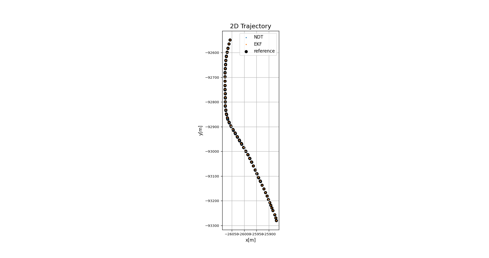
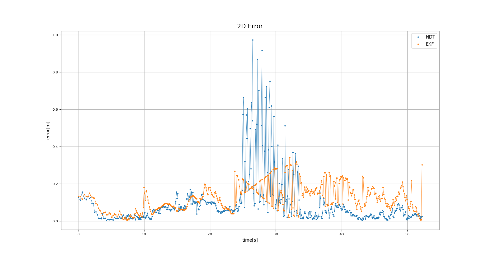
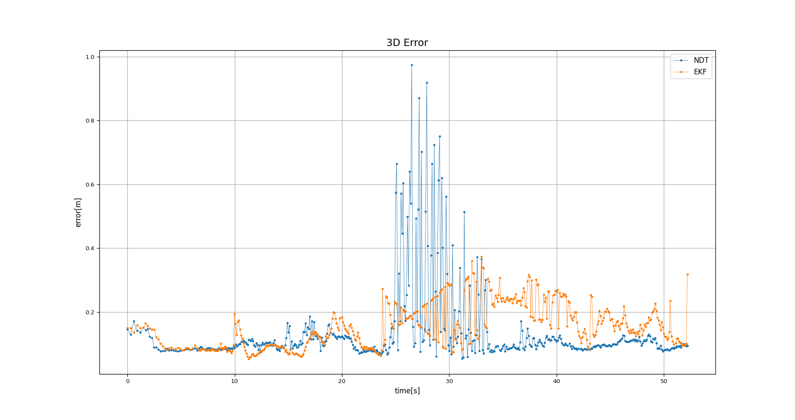
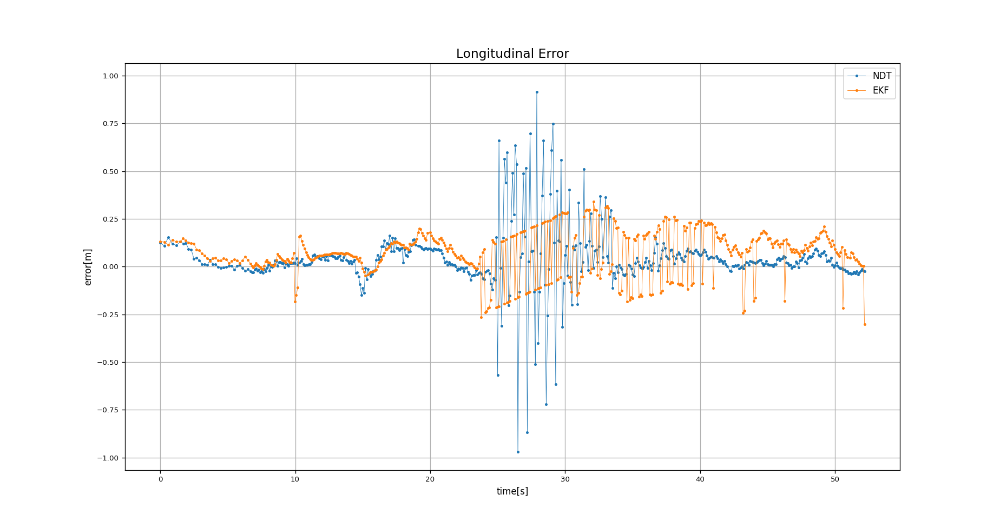
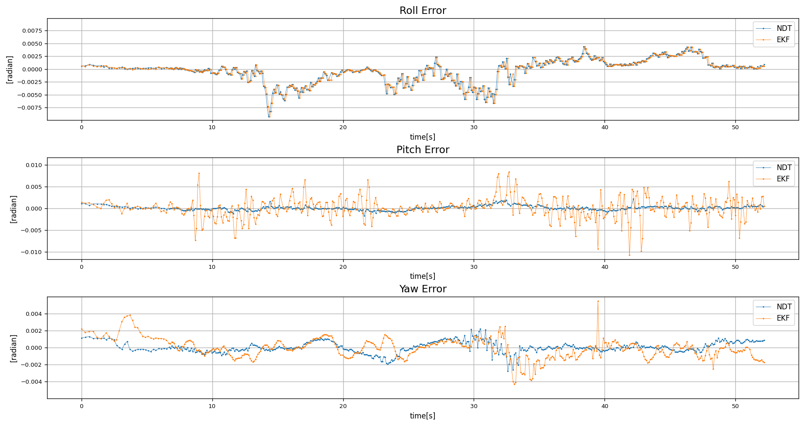

# localization_evaluation_toolkit

An evaluator for localization results, which compares with a reliable pose trajectory. Specifically, comparisons between different start times, end times, and periods are supported, since evaluation will be automatically aligned with the one with fewer data.

## 1. Installation & Preparation

Clone this repo to the local environment.

```sh
$ git clone https://github.com/MapIV/localization_evaluation_toolkit.git
```

Evaluatable data types are limited to the format of CSV or ros2 bag, and the start time, end time, and period can be different for each data.
Specifically, a valid **CSV file** requires at least the following entries.

- Timestamp
- Position (x,y,z)
- Rotation (Quaternion or Euler[degree or radian])

And a valid ros2 bag file should have one of the following types of topics.

- `geometry_msgs/msg/PoseWithCovarianceStamped`
- `nav_msgs/msg/Odometry`

## 2. Main-evaluation

### 2.1 Pose evaluation

A standard configuration file for pose evaluation consists of the following parts.

- Reference
- Result1, Result2, ...
- Optional settings

It is required that the reference block should have the name of ***Reference*** and the names of result blocks should begin with ***Result***.
When specifying the paths, it is recommended to use the absolute path.
There is a sample YAML file at `config/evaluation_pose.yaml`.
To create your own configuration file, just use the following templates for CSV or ros2 bag,

<details>
<summary>Template of CSV (click to expand)</summary>

```yaml
Reference/Result:
  ## Auxiliary info
  label: any
  type: 0 # [0]: csv, [1]: ros2bag
  path: /path/to/csv

  ## Time
  separate_time_stamp: false # [true]:Set secs_stamp_column and nsecs_stamp_column / [false]:Set stamp_column
  #--------true--------#
  secs_stamp_column: 2
  nsecs_stamp_column: 3
  #--------false-------#
  stamp_column: 0

  ## Position
  x_column: 1
  y_column: 2
  z_column: 3

  ## Rotation
  use_quaternion: false # [true]:Set Quaternion / [false]:Set Euler
  #--------true--------#
  # Quaternion
  ori_x_column: 8
  ori_y_column: 9
  ori_z_column: 10
  ori_w_column: 11
  #--------false-------#
  # Euler
  use_radian: true # [true]:radian / [false]:degree
  roll_column: 4
  pitch_column: 5
  yaw_column: 6

  ## TF
  tf_time: 0   # [s]
  tf_x: 0      # [m]
  tf_y: 0      # [m]
  tf_z: 0      # [m]
  tf_roll: 0   # [rad]
  tf_pitch: 0  # [rad]
  tf_yaw: 0    # [rad]
  inv_roll: 1  # 1 or -1
  inv_pitch: 1 # 1 or -1
  inv_yaw: 1   # 1 or -1

  # Display ellipse (put 2D covariance in result file)
  display_ellipse: false
  covariance_xx_column: 10
  covariance_xy_column: 11
  covariance_yx_column: 12
  covariance_yy_column: 13
```

</details>

<details>
<summary>Template of ros2 bag (click to expand)</summary>

```yaml
Reference/Result:
  ## Auxiliary info
  label: any
  type: 1 # [0]: csv, [1]: ros2bag
  path: /path/to/ros2bag

  ## Rosbag info
  topic_name: /localization/pose_estimator/pose_with_covariance
  storage_id: sqlite3
  serialization_format: cdr

  ## TF
  tf_time: 0   # [s]
  tf_x: 0      # [m]
  tf_y: 0      # [m]
  tf_z: 0      # [m]
  tf_roll: 0   # [rad]
  tf_pitch: 0  # [rad]
  tf_yaw: 0    # [rad]
  inv_roll: 1  # 1 or -1
  inv_pitch: 1 # 1 or -1
  inv_yaw: 1   # 1 or -1

  # Display ellipse (put 2D covariance in result file)
  display_ellipse: false # use PoseWithCovarianceStamped tyep topic in result data
```

</details>

<details>
<summary>Template of optional settings (click to expand)</summary>

```yaml
# Horizontal axis
axis_type: 0   # [0]:time, [1]:distance
degree_type: 0 # [0]:radian, [1]:degree

# Trajectory graph dilution
dilution_step: 10 # at least 1, the larger the sparser for better performance

# Trajectory graph numbering
progress_info: 0 # [0]:off, [1]:number, [2]:time, [3]:ros time, [4]:distance
interval: 0      # progress_info is [2]:second, [3]:second, [4]:meter

# Font
title_font_size: 14 
label_font_size: 10
ticks_font_size: 8

# Save
save_figures: true
save_extension_type: png # without "."
save_dataframe: true
output_directory: /path/to/output/directory

use_lerp: false
```

</details>

and run with

```sh
$ cd localization_evaluation_toolkit
$ python3 scripts/pose_main.py config/evaluation_pose.yaml
```

For example, you may output the following graphs with the sample data.

```sh
$ cd localization_evaluation_toolkit
$ python3 scripts/pose_main.py sample_data/config/sasashima_evaluation.yaml
```

<details>
<summary>2D Trajectory</summary>

When you zoom in on the graph, you can see the correspondence.

</details>

<details>
<summary>3D Trajectory</summary>

</details>

<details>
<summary>X Y Z</summary>

</details>

<details>
<summary>X Y Z error</summary>

</details>

<details>
<summary>2D Error</summary>

</details>

<details>
<summary>3D Error</summary>

</details>

<details>
<summary>Longitudinal Error</summary>

</details>

<details>
<summary>Lateral Error</summary>

</details>

<details>
<summary>Roll Pitch Yaw</summary>
You can choose the unit of the vertical axis between radian and degree.

</details>

<details>
<summary>Roll Pitch Yaw Error</summary>
You can choose the unit of the vertical axis between radian and degree.

</details>

### 2.2 Twist evaluation

A standard configuration file for twist evaluation consists of the following parts.

- Reference
- Twist
- Optional settings

It is required that the reference block should have the name of ***Reference*** and the names of result blocks should begin with ***Twist***.
When specifying the paths, it is recommended to use the absolute path.
There is a sample YAML file at `config/evaluation_twist.yaml`.
To create your own configuration file, just use the following templates,

<details>
<summary>Template of Reference (click to expand)</summary>

```yaml
Reference:
  ## Auxiliary info
  label: reference
  path: /path/to/reference/csv

  ## Time
  separate_time_stamp: false # [true]:Set secs_stamp_column and nsecs_stamp_column / [false]:Set stamp_column
  #--------true--------#
  secs_stamp_column: 1
  nsecs_stamp_column: 2
  #--------false-------#
  stamp_column: 2

  ## Position
  x_column: 4
  y_column: 5
  z_column: 6

  ## Rotation
  use_quaternion: true # [true]:Set Quaternion / [false]:Set Euler
  #--------true--------#
  # Quaternion
  ori_x_column: 7
  ori_y_column: 8
  ori_z_column: 9
  ori_w_column: 10
  #--------false-------#
  # Euler
  use_radian: true # [true]:radian / [false]:degree
  roll_column: 7
  pitch_column: 8
  yaw_column: 9

  ## Enu velocity
  use_enu_vel: false # [true]: use enu velocity / [false]: ignored
  vel_x_column: 0
  vel_y_column: 0
  vel_z_column: 0

  ## Angular
  use_angular: false # [true]: use angular / [false]: ignored
  angular_x_column: 0
  angular_y_column: 0
  angular_z_column: 0

  # GNSS quality
  use_gnss_qual: false # [true]: use GNSS quality / [false]: ignored
  gnss_qual: 10
```

</details>

<details>
<summary>Template of Twist (click to expand)</summary>

```yaml
Twist:
  ## Auxiliary info
  label: twist
  path: /path/to/twist/csv

  ## Time
  separate_time_stamp: false # [true]:Set secs_stamp_column and nsecs_stamp_column / [false]:Set stamp_column
  #--------true--------#
  secs_stamp_column: 1
  nsecs_stamp_column: 2
  #--------false-------#
  stamp_column: 2

  ## Linear
  linear_x_column: 4
  linear_y_column: 5
  linear_z_column: 6

  ## Angular
  angular_x_column: 7
  angular_y_column: 8
  angular_z_column: 9
```

</details>

<details>
<summary>Template of optional settings (click to expand)</summary>

```yaml
# Trajectory graph numbering
progress_info: 0 # [0]:off, [1]:number, [2]:time, [3]:ros time, [4]:distance
interval: 0      # progress_info is [2]:second, [3]:second, [4]:meter

# Misc
sync_time_threshold: 0.01  # Time threshold for judgment for time synchronization [s]
leap_time: 0.0             # Offset correction for time synchronizatio [s]
based_heading_angle: false # [true]:The heading angle is based on North / [false]:The heading angle is based on East (ros data)
distance_length: 100       # Distance to calculate relative trajectory [m]
distance_step: 50          # Calculate relative trajectories step [m]
eval_step_max: 3.0   # Maximum value of error to be evaluated default [m]

# Font
title_font_size: 14
label_font_size: 10
ticks_font_size: 8

# Save
save_figures: true
save_extension_type: png # without "."
save_dataframe: true
output_directory: /path/to/output/directory
```

</details>

and run with

```sh
$ cd localization_evaluation_toolkit
$ python3 scripts/twist_main.py config/evaluation_twist.yaml
```

## 3. Sub-evaluation

### 3.1 NDT performance

Evaluation of TP, NVTL, execution time, iteration and error ellipse with ros2 bag files.

The input rosbag file should contain the following (at least one) topic.
```
/localization/pose_estimator/pose_with_covariance
/localization/pose_estimator/nearest_voxel_transformation_likelihood
/localization/pose_estimator/transform_probability
/localization/pose_estimator/exe_time_ms
/localization/pose_estimator/iteration_num
```

```sh
$ cd localization_evaluation_toolkit/sub_scripts
$ source ~/xxxxxx/install/setup.bash
$ python3 sub_ndt_evaluation.py [bag_path] [output_folder_path]
```

### 3.2 Eagleye log evaluation

Currently, refer to [the original doc page](https://github.com/MapIV/eagleye/tree/main-ros1/eagleye_util/trajectory_plot#eagleye_pp_single_evaluation) for details.

### 3.3 Covariance file generation

Create a CSV file with covariance columns from rosbag file. In detail, refer to [qiita article](https://qiita.com/koki2022/items/148d56e0f8eee45a0a62) for details.

```sh
$ cd localization_evaluation_toolkit/sub_scripts
$ python covariance_to_csv.py [input_bag_path] [output_folder_path]
```
